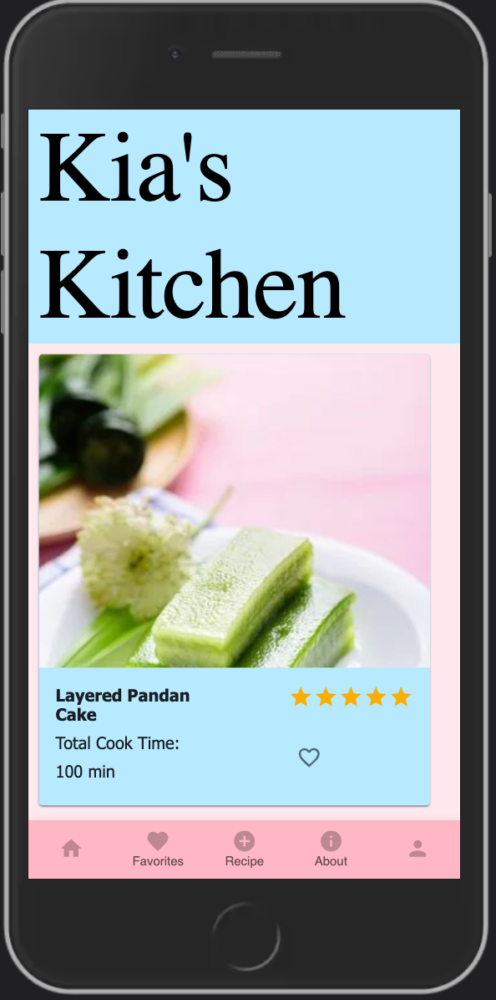
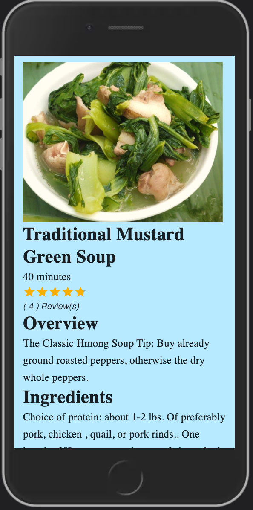
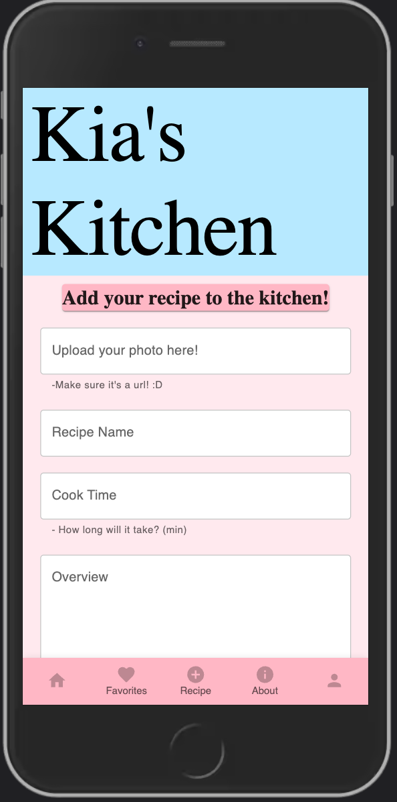
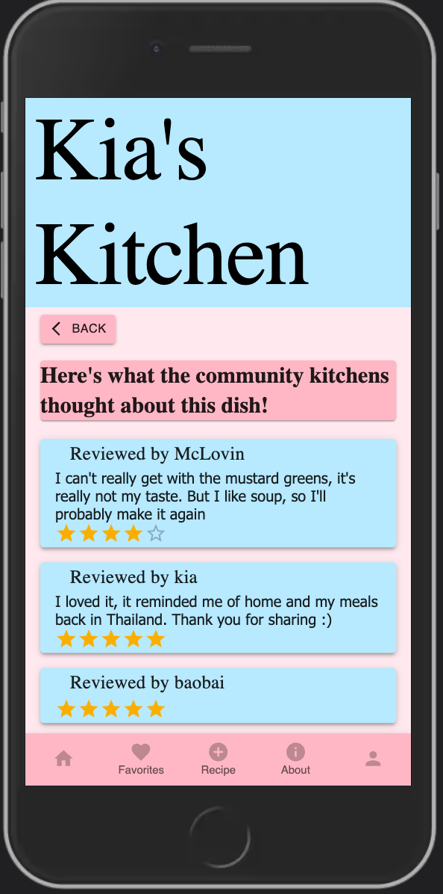
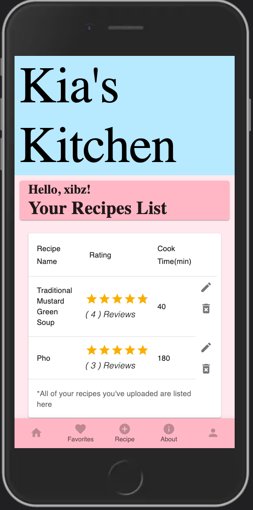
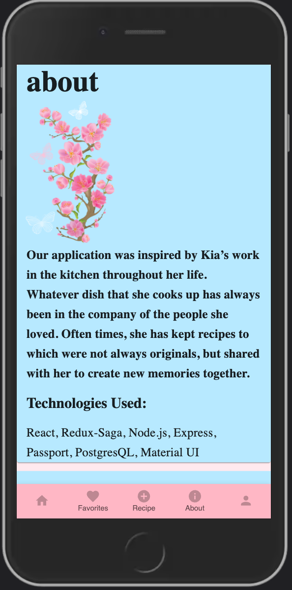

# Kia's Kitchen

## Table of Contents

- [Description](#description)
- [Screenshots](#screenshots)
- [Built With](#built-with)
- [Getting Started](#getting-started)
  - [Prerequisites](#prerequisites)
  - [Installation](#installation)
- [Usage](#usage)
- [License](#license)
- [Acknowledgements](#acknowledgements)
- [Contacts](#contacts)

## Description

Full CRUD application for viewing Southeast Asian cuisines and getting a taste of my mother's recipes. Users can upload their own recipes, provide feedback through comments and ratings on other recipes. 

## Screenshots

## Getting Started

### Prerequisites

Before you get started, make sure you have the following software installed on your computer:

- [Node.js](https://nodejs.org/en/)
- [PostrgeSQL](https://www.postgresql.org/)
- [Nodemon](https://nodemon.io/)

### Installation

1. Clone the repository 
2. Set up a database called kias-kitchen. Using the database.sql file provided, create your tables and add some data(if you have some pre-existing data already).
3. Run the 'npm install' command to automatically install all necessary dependencies.
4. Split your terminals in your code editor so you can 'npm run server' in one server to get the server up and running. Then 'npm run client' to find yourself on http://localhost:3000/. 
5. Enjoy yourself in the app :D

## Usage

## License

<a href="https://choosealicense.com/licenses/mit/">MIT License</a>

## Acknowledgements

I want to give a HUGE thanks to Prime Digital Academy and everyone who has supported me throughout this process. They've been nothing short of spectacular and a special shoutout to my lovely mother, Kia who inspired me to create this app. 

## Contacts

  

